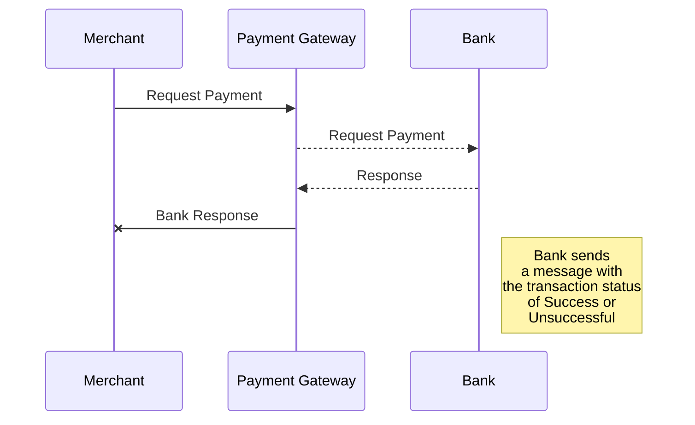
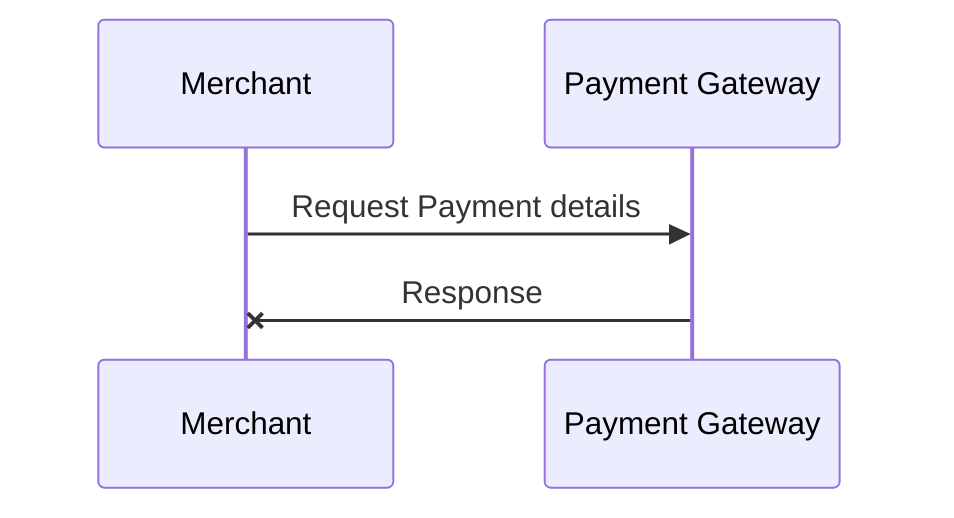

# payment-gateway
This is an exercise for the coding chagelling from Checkout.com


<a href="https://github.com/rafaelqueiroz89/payment-gateway/actions?query=workflow%3A%22.NET+Core+build+script%22+branch%3Amaster"></a> status from the <i>master</i> branch

Ideally we should not expose Domain objects to the external world, instead we should create an Adapter or use a framework like AutoMapper to transform my Domain object into a DTO and transfer it to different systems

My branch master is protected and doesn't allow a force push if the development branch is with build fail
======


# Business Discussion
We will be taking in account that the business needs 2 different flows, the first is requesting a payment from the merchant and the second one is retrieving a made transaction request. The actors of the whole system are:

1. Shopper: Individual who is buying the product online. 
2. Merchant: The seller of the product.
3. Payment Gateway: Responsible for validating requests, storing card information and forwarding payment requests and accepting payment responses to and from the acquiring bank. 
4. Acquiring Bank: Allows us to do the actual retrieval of money from the shopper’s card and payout to the merchant. It also performs some validation of the card information and then sends the payment details to the appropriate 3rd party organization for processing.

## Diagrams

<b>Merchant requests a payment</b>


<b>Merchant requests to see the details of a Payment</b>


<b>Overview of the big picture</b>

```mermaid
sequenceDiagram
Merchant ->> Payment Gateway: Request Payment details
Payment Gateway-x Merchant : Response
